# Genet 技术架构文档

本文档详细介绍 Genet 系统的整体架构、核心模块和交互流程。

## 目录

- [1. 系统概述](#1-系统概述)
- [2. 整体架构](#2-整体架构)
- [3. 后端模块](#3-后端模块)
- [4. 前端模块](#4-前端模块)
- [5. 核心流程](#5-核心流程)
- [6. 数据模型](#6-数据模型)
- [7. 配置系统](#7-配置系统)
- [8. 部署架构](#8-部署架构)

---

## 1. 系统概述

Genet 是一个基于 Kubernetes 的 GPU Pod 管理平台，提供以下核心能力：

| 功能 | 说明 |
|------|------|
| Pod 生命周期管理 | 创建、删除、保护、监控用户 Pod |
| GPU 资源可视化 | 热力图展示集群 GPU 使用情况 |
| 多种认证方式 | OAuth2/OIDC、代理头部、开发模式 |
| Kubeconfig 生成 | 证书模式和 OIDC 模式 |
| 镜像保存 | 将运行中的 Pod 保存为镜像 |
| 自动清理 | 定时删除过期 Pod |

### 技术栈

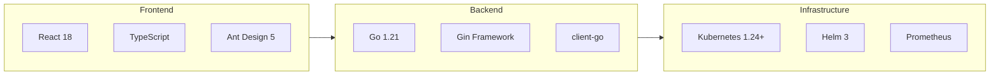
```mermaid
graph LR
    subgraph Frontend
        React[React 18]
        TS[TypeScript]
        Antd[Ant Design 5]
    end

    subgraph Backend
        Go[Go 1.21]
        Gin[Gin Framework]
        ClientGo[client-go]
    end

    subgraph Infrastructure
        K8s[Kubernetes 1.24+]
        Helm[Helm 3]
        Prom[Prometheus]
    end

    Frontend --> Backend
    Backend --> Infrastructure
```

---

## 2. 整体架构

### 2.1 系统架构图

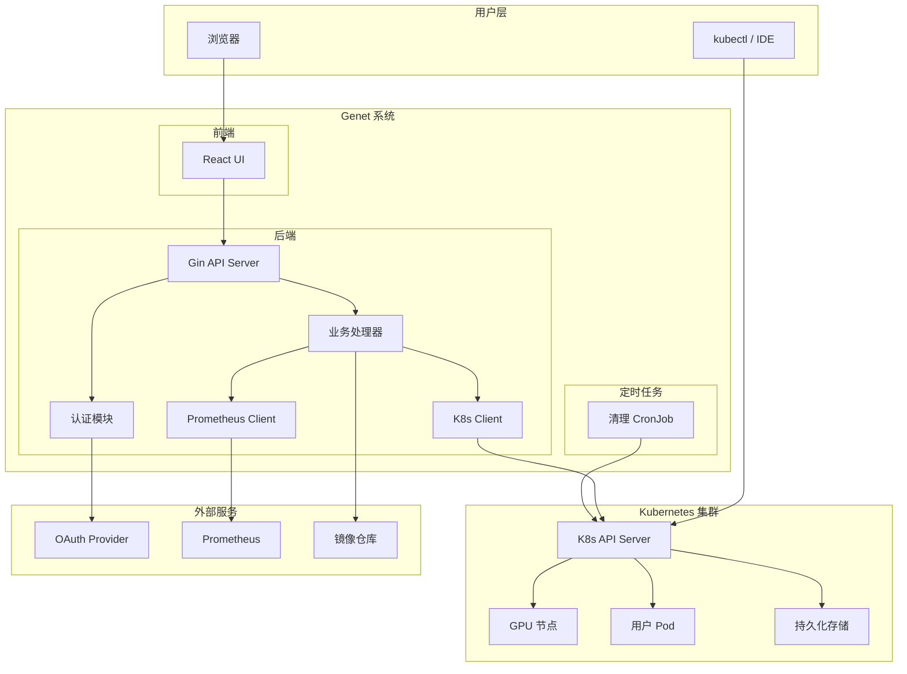
```mermaid
graph TB
    subgraph 用户层
        Browser[浏览器]
        CLI[kubectl / IDE]
    end

    subgraph Genet 系统
        subgraph 前端
            UI[React UI]
        end

        subgraph 后端
            API[Gin API Server]
            Auth[认证模块]
            Handlers[业务处理器]
            K8sClient[K8s Client]
            PromClient[Prometheus Client]
        end

        subgraph 定时任务
            Cleanup[清理 CronJob]
        end
    end

    subgraph Kubernetes 集群
        APIServer[K8s API Server]
        Nodes[GPU 节点]
        Pods[用户 Pod]
        PVC[持久化存储]
    end

    subgraph 外部服务
        OAuth[OAuth Provider]
        Prometheus[Prometheus]
        Registry[镜像仓库]
    end

    Browser --> UI
    UI --> API
    CLI --> APIServer

    API --> Auth
    Auth --> OAuth
    API --> Handlers
    Handlers --> K8sClient
    Handlers --> PromClient

    K8sClient --> APIServer
    PromClient --> Prometheus

    APIServer --> Nodes
    APIServer --> Pods
    APIServer --> PVC

    Cleanup --> APIServer
    Handlers --> Registry
```

### 2.2 请求处理流程

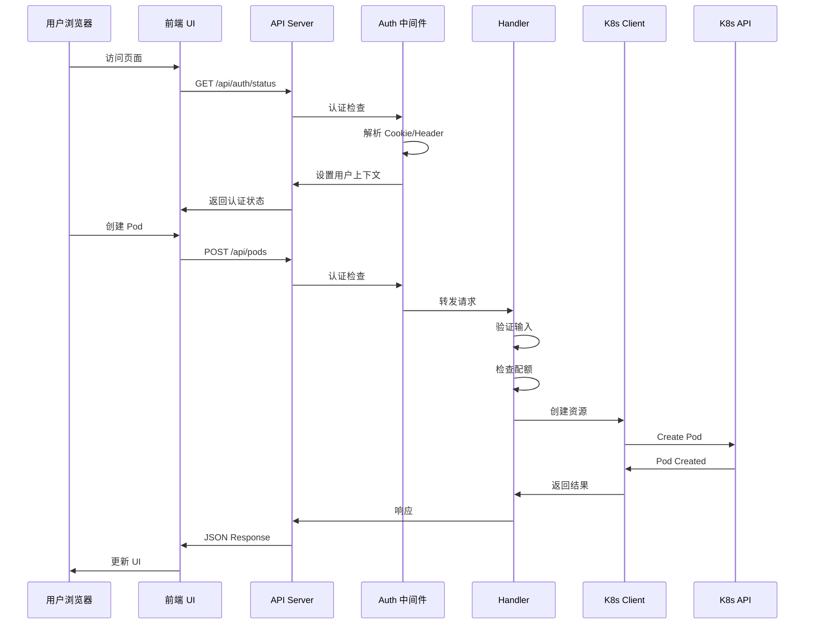
```mermaid
sequenceDiagram
    participant U as 用户浏览器
    participant F as 前端 UI
    participant A as API Server
    participant M as Auth 中间件
    participant H as Handler
    participant K as K8s Client
    participant API as K8s API

    U->>F: 访问页面
    F->>A: GET /api/auth/status
    A->>M: 认证检查
    M->>M: 解析 Cookie/Header
    M->>A: 设置用户上下文
    A->>F: 返回认证状态

    U->>F: 创建 Pod
    F->>A: POST /api/pods
    A->>M: 认证检查
    M->>H: 转发请求
    H->>H: 验证输入
    H->>H: 检查配额
    H->>K: 创建资源
    K->>API: Create Pod
    API->>K: Pod Created
    K->>H: 返回结果
    H->>A: 响应
    A->>F: JSON Response
    F->>U: 更新 UI
```

---

## 3. 后端模块

### 3.1 模块结构

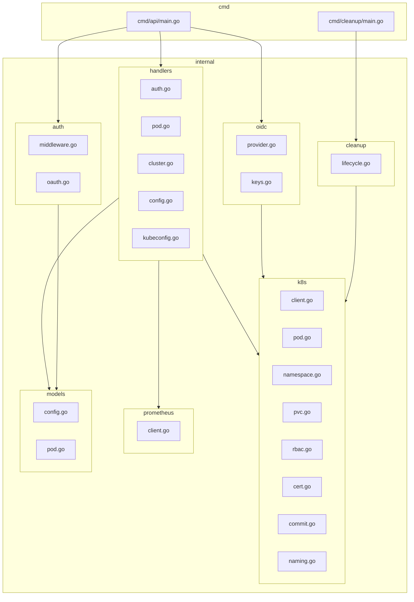
```mermaid
graph TB
    subgraph cmd
        APIMain[cmd/api/main.go]
        CleanupMain[cmd/cleanup/main.go]
    end

    subgraph internal
        subgraph handlers
            AuthH[auth.go]
            PodH[pod.go]
            ClusterH[cluster.go]
            ConfigH[config.go]
            KubeconfigH[kubeconfig.go]
        end

        subgraph auth
            Middleware[middleware.go]
            OAuth[oauth.go]
        end

        subgraph k8s
            Client[client.go]
            Pod[pod.go]
            NS[namespace.go]
            PVC[pvc.go]
            RBAC[rbac.go]
            Cert[cert.go]
            Commit[commit.go]
            Naming[naming.go]
        end

        subgraph oidc
            Provider[provider.go]
            Keys[keys.go]
        end

        subgraph prometheus
            PromClient[client.go]
        end

        subgraph models
            Config[config.go]
            PodModel[pod.go]
        end

        subgraph cleanup
            Lifecycle[lifecycle.go]
        end
    end

    APIMain --> handlers
    APIMain --> auth
    APIMain --> oidc
    CleanupMain --> cleanup

    handlers --> k8s
    handlers --> prometheus
    handlers --> models

    auth --> models
    oidc --> k8s
    cleanup --> k8s
```

### 3.2 Handler 模块详解

#### PodHandler - Pod 生命周期管理

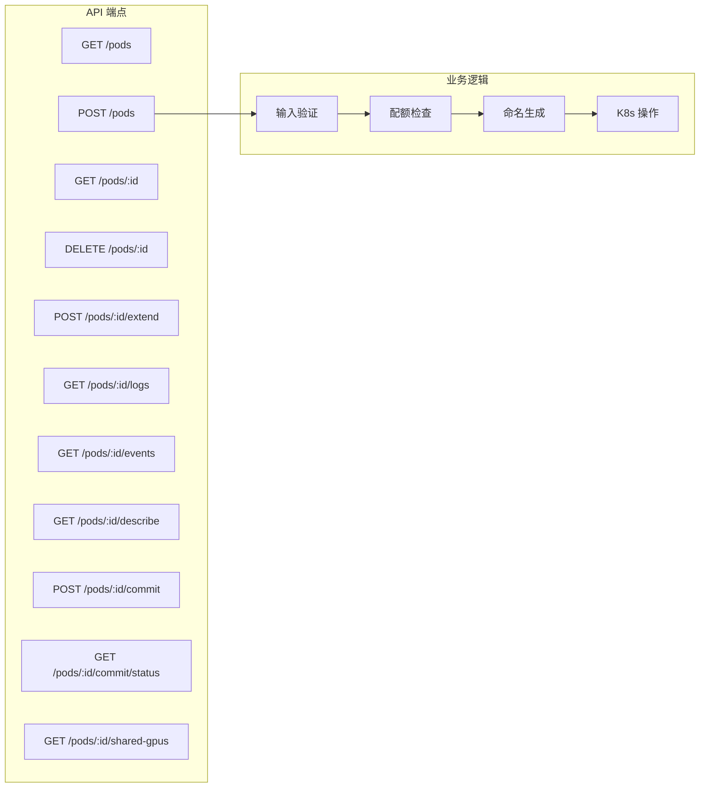
```mermaid
graph LR
    subgraph API 端点
        List[GET /pods]
        Create[POST /pods]
        Get[GET /pods/:id]
        Delete[DELETE /pods/:id]
        Extend[POST /pods/:id/extend]
        Logs[GET /pods/:id/logs]
        Events[GET /pods/:id/events]
        Describe[GET /pods/:id/describe]
        Commit[POST /pods/:id/commit]
        CommitStatus[GET /pods/:id/commit/status]
        SharedGPU[GET /pods/:id/shared-gpus]
    end

    subgraph 业务逻辑
        Quota[配额检查]
        Validate[输入验证]
        Naming[命名生成]
        K8sOps[K8s 操作]
    end

    Create --> Validate
    Validate --> Quota
    Quota --> Naming
    Naming --> K8sOps
```

**核心功能：**

| 端点 | 功能 | 说明 |
|------|------|------|
| `POST /pods` | 创建 Pod | 验证输入、检查配额、创建 NS/PVC/Pod |
| `DELETE /pods/:id` | 删除 Pod | 支持级联删除 PVC（根据策略） |
| `POST /pods/:id/extend` | 延长保护期 | 设置 `protected-until` 注解 |
| `POST /pods/:id/commit` | 保存镜像 | 创建 nerdctl commit Job |
| `GET /pods/:id/shared-gpus` | 共用 GPU | 查找时分复用场景下的共用 Pod |

#### ClusterHandler - 集群资源信息

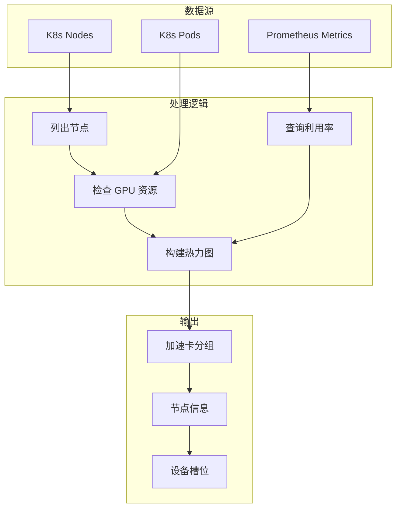
```mermaid
graph TB
    subgraph 数据源
        Nodes[K8s Nodes]
        Pods[K8s Pods]
        Prom[Prometheus Metrics]
    end

    subgraph 处理逻辑
        ListNodes[列出节点]
        CheckResource[检查 GPU 资源]
        QueryMetrics[查询利用率]
        BuildHeatmap[构建热力图]
    end

    subgraph 输出
        AcceleratorGroups[加速卡分组]
        NodeInfo[节点信息]
        DeviceSlots[设备槽位]
    end

    Nodes --> ListNodes
    ListNodes --> CheckResource
    Pods --> CheckResource
    Prom --> QueryMetrics
    CheckResource --> BuildHeatmap
    QueryMetrics --> BuildHeatmap
    BuildHeatmap --> AcceleratorGroups
    AcceleratorGroups --> NodeInfo
    NodeInfo --> DeviceSlots
```

### 3.3 认证模块

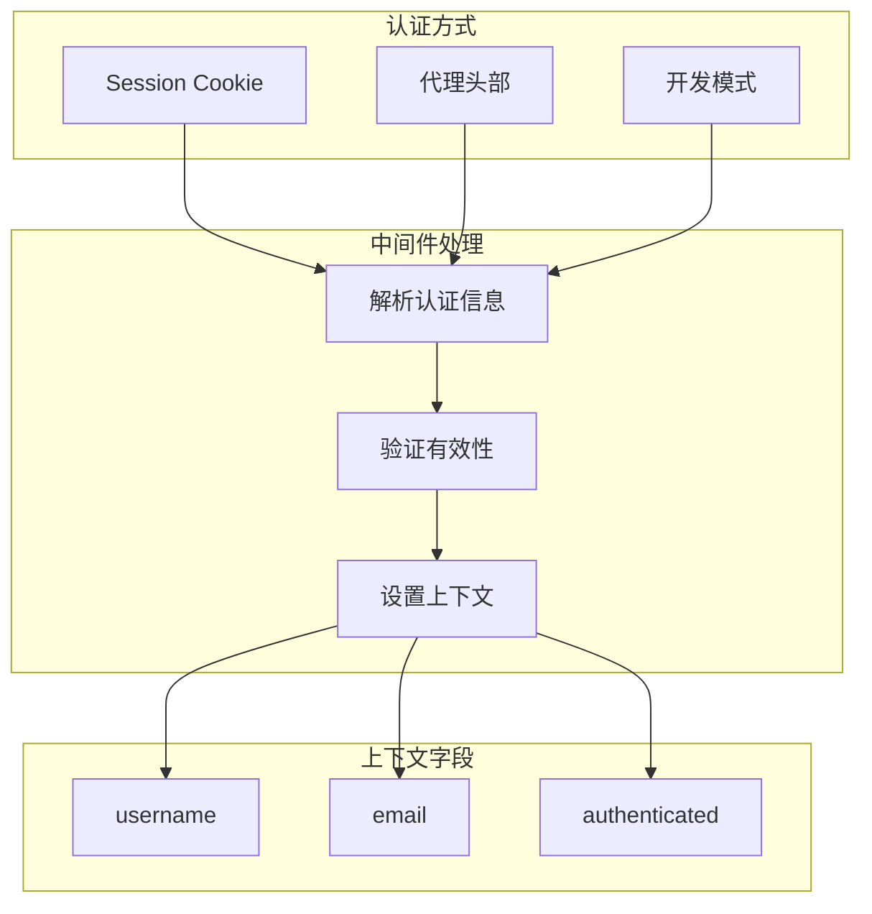
```mermaid
graph TB
    subgraph 认证方式
        Cookie[Session Cookie]
        Header[代理头部]
        Dev[开发模式]
    end

    subgraph 中间件处理
        Parse[解析认证信息]
        Validate[验证有效性]
        SetContext[设置上下文]
    end

    subgraph 上下文字段
        Username[username]
        Email[email]
        Authenticated[authenticated]
    end

    Cookie --> Parse
    Header --> Parse
    Dev --> Parse
    Parse --> Validate
    Validate --> SetContext
    SetContext --> Username
    SetContext --> Email
    SetContext --> Authenticated
```

**认证优先级：**

1. **Session Cookie** - OAuth 登录后设置
2. **代理头部** - 兼容 OAuth2 Proxy
   - `X-Auth-Request-User`
   - `X-Auth-Request-Email`
3. **开发模式** - OAuth 未启用时
   - 查询参数 `?user=xxx`
   - 默认 `dev-user`

### 3.4 K8s 操作模块

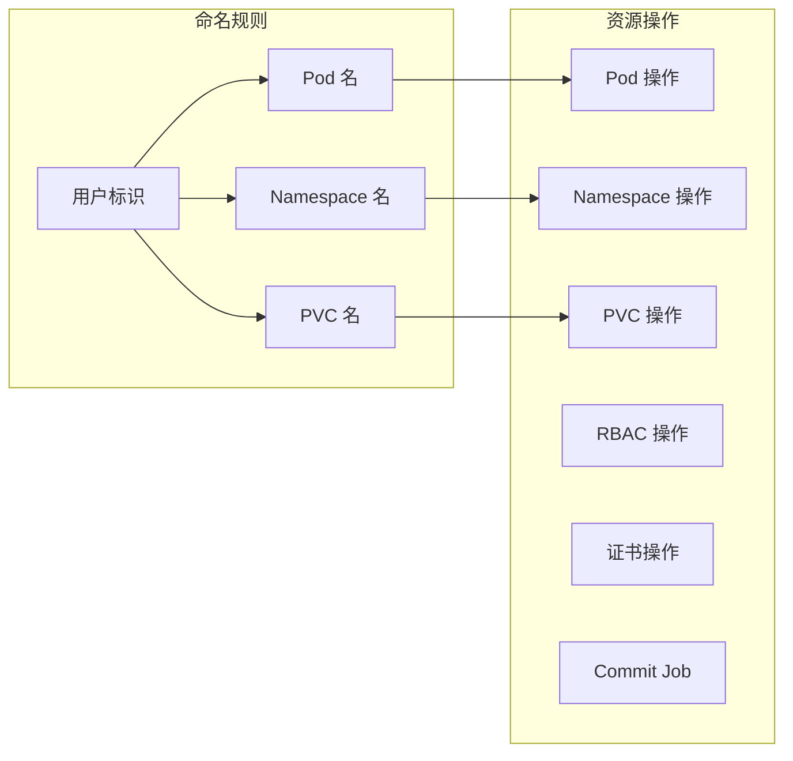
```mermaid
graph LR
    subgraph 资源操作
        PodOps[Pod 操作]
        NSOps[Namespace 操作]
        PVCOps[PVC 操作]
        RBACOps[RBAC 操作]
        CertOps[证书操作]
        CommitOps[Commit Job]
    end

    subgraph 命名规则
        UserID[用户标识]
        NSName[Namespace 名]
        PodName[Pod 名]
        PVCName[PVC 名]
    end

    UserID --> NSName
    UserID --> PodName
    UserID --> PVCName

    NSName --> NSOps
    PodName --> PodOps
    PVCName --> PVCOps
```

**命名规则（naming.go）：**

| 资源 | 格式 | 示例 |
|------|------|------|
| UserIdentifier | `{username}-{emailPrefix}` | `zhangsan-zs` |
| Namespace | `user-{userIdentifier}` | `user-zhangsan-zs` |
| Pod | `pod-{userIdentifier}-{name/timestamp}` | `pod-zhangsan-zs-train` |
| PVC | `{userIdentifier}-workspace` | `zhangsan-zs-workspace` |
| Job | `commit-{userIdentifier}-{timestamp}` | `commit-zhangsan-zs-1706520000` |

### 3.5 OIDC Provider 模块

Genet 可作为 OIDC Provider，将企业 OAuth 转换为标准 OIDC，供 K8s API Server 使用。

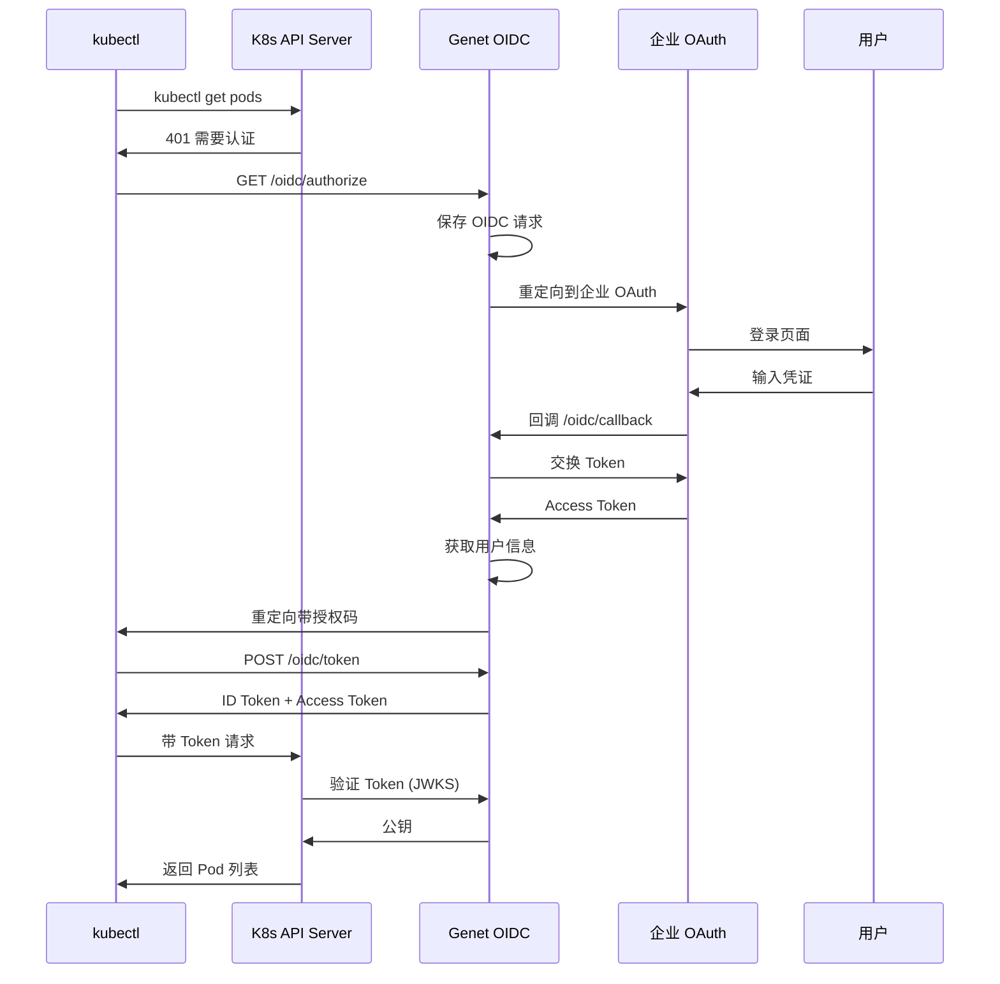
```mermaid
sequenceDiagram
    participant K as kubectl
    participant API as K8s API Server
    participant G as Genet OIDC
    participant E as 企业 OAuth
    participant U as 用户

    K->>API: kubectl get pods
    API->>K: 401 需要认证
    K->>G: GET /oidc/authorize
    G->>G: 保存 OIDC 请求
    G->>E: 重定向到企业 OAuth
    E->>U: 登录页面
    U->>E: 输入凭证
    E->>G: 回调 /oidc/callback
    G->>E: 交换 Token
    E->>G: Access Token
    G->>G: 获取用户信息
    G->>K: 重定向带授权码
    K->>G: POST /oidc/token
    G->>K: ID Token + Access Token
    K->>API: 带 Token 请求
    API->>G: 验证 Token (JWKS)
    G->>API: 公钥
    API->>K: 返回 Pod 列表
```

**端点：**

| 端点 | 说明 |
|------|------|
| `/.well-known/openid-configuration` | OIDC 发现 |
| `/oidc/authorize` | 授权端点 |
| `/oidc/token` | Token 端点 |
| `/oidc/userinfo` | 用户信息端点 |
| `/oidc/jwks` | JWKS 公钥 |

---

## 4. 前端模块

### 4.1 页面结构

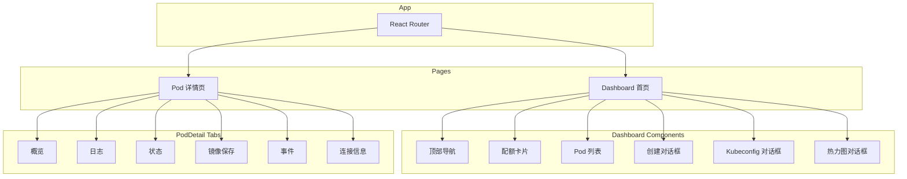
```mermaid
graph TB
    subgraph App
        Router[React Router]
    end

    subgraph Pages
        Dashboard[Dashboard 首页]
        PodDetail[Pod 详情页]
    end

    subgraph Dashboard Components
        Header[顶部导航]
        QuotaCard[配额卡片]
        PodList[Pod 列表]
        CreateModal[创建对话框]
        KubeconfigModal[Kubeconfig 对话框]
        HeatmapModal[热力图对话框]
    end

    subgraph PodDetail Tabs
        Overview[概览]
        Logs[日志]
        Describe[状态]
        Commit[镜像保存]
        Events[事件]
        Connection[连接信息]
    end

    Router --> Dashboard
    Router --> PodDetail

    Dashboard --> Header
    Dashboard --> QuotaCard
    Dashboard --> PodList
    Dashboard --> CreateModal
    Dashboard --> KubeconfigModal
    Dashboard --> HeatmapModal

    PodDetail --> Overview
    PodDetail --> Logs
    PodDetail --> Describe
    PodDetail --> Commit
    PodDetail --> Events
    PodDetail --> Connection
```

### 4.2 核心组件

#### AcceleratorHeatmap - GPU 热力图

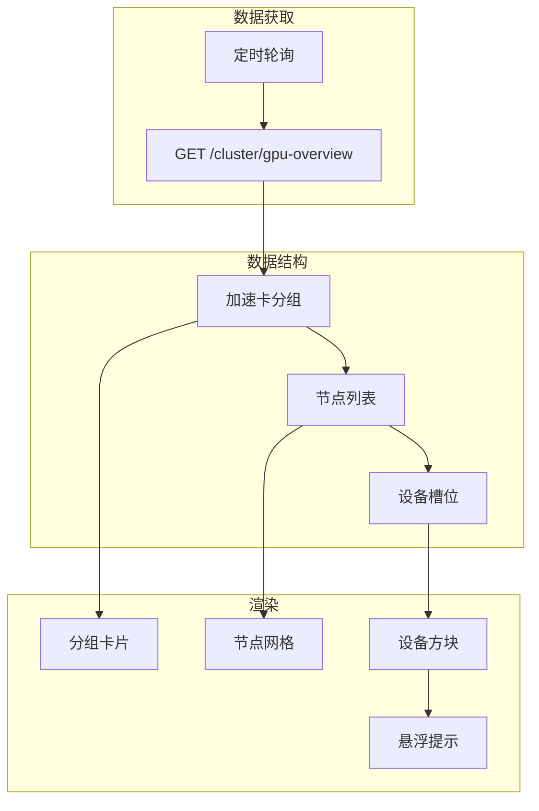
```mermaid
graph TB
    subgraph 数据获取
        API[GET /cluster/gpu-overview]
        Polling[定时轮询]
    end

    subgraph 数据结构
        Groups[加速卡分组]
        Nodes[节点列表]
        Slots[设备槽位]
    end

    subgraph 渲染
        GroupCard[分组卡片]
        NodeGrid[节点网格]
        SlotBlock[设备方块]
        Tooltip[悬浮提示]
    end

    API --> Groups
    Polling --> API
    Groups --> Nodes
    Nodes --> Slots

    Groups --> GroupCard
    Nodes --> NodeGrid
    Slots --> SlotBlock
    SlotBlock --> Tooltip
```

**设备状态颜色：**

| 状态 | 颜色 | 说明 |
|------|------|------|
| 空闲 | 🟢 绿色 | 设备未被占用 |
| 已用 | 🔴 红色 | 设备已被 Pod 占用 |
| 未知 | ⚪ 灰色 | 无法获取状态 |

#### CreatePodModal - 创建 Pod 表单

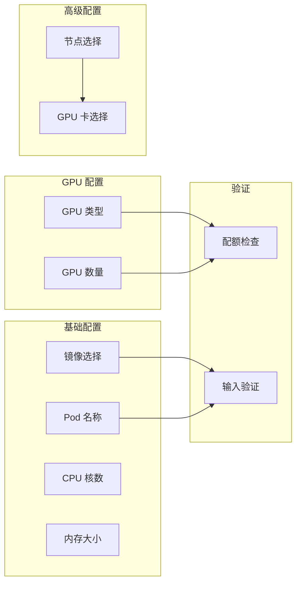
```mermaid
graph LR
    subgraph 基础配置
        Image[镜像选择]
        Name[Pod 名称]
        CPU[CPU 核数]
        Memory[内存大小]
    end

    subgraph GPU 配置
        GPUType[GPU 类型]
        GPUCount[GPU 数量]
    end

    subgraph 高级配置
        NodeSelect[节点选择]
        GPUSelect[GPU 卡选择]
    end

    subgraph 验证
        QuotaCheck[配额检查]
        InputValidate[输入验证]
    end

    Image --> InputValidate
    Name --> InputValidate
    GPUType --> QuotaCheck
    GPUCount --> QuotaCheck
    NodeSelect --> GPUSelect
```

### 4.3 状态管理

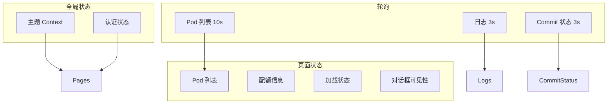
```mermaid
graph TB
    subgraph 全局状态
        Theme[主题 Context]
        Auth[认证状态]
    end

    subgraph 页面状态
        Pods[Pod 列表]
        Quota[配额信息]
        Loading[加载状态]
        Modals[对话框可见性]
    end

    subgraph 轮询
        PodPolling[Pod 列表 10s]
        LogPolling[日志 3s]
        CommitPolling[Commit 状态 3s]
    end

    Theme --> Pages
    Auth --> Pages

    PodPolling --> Pods
    LogPolling --> Logs
    CommitPolling --> CommitStatus
```

---

## 5. 核心流程

### 5.1 用户登录流程

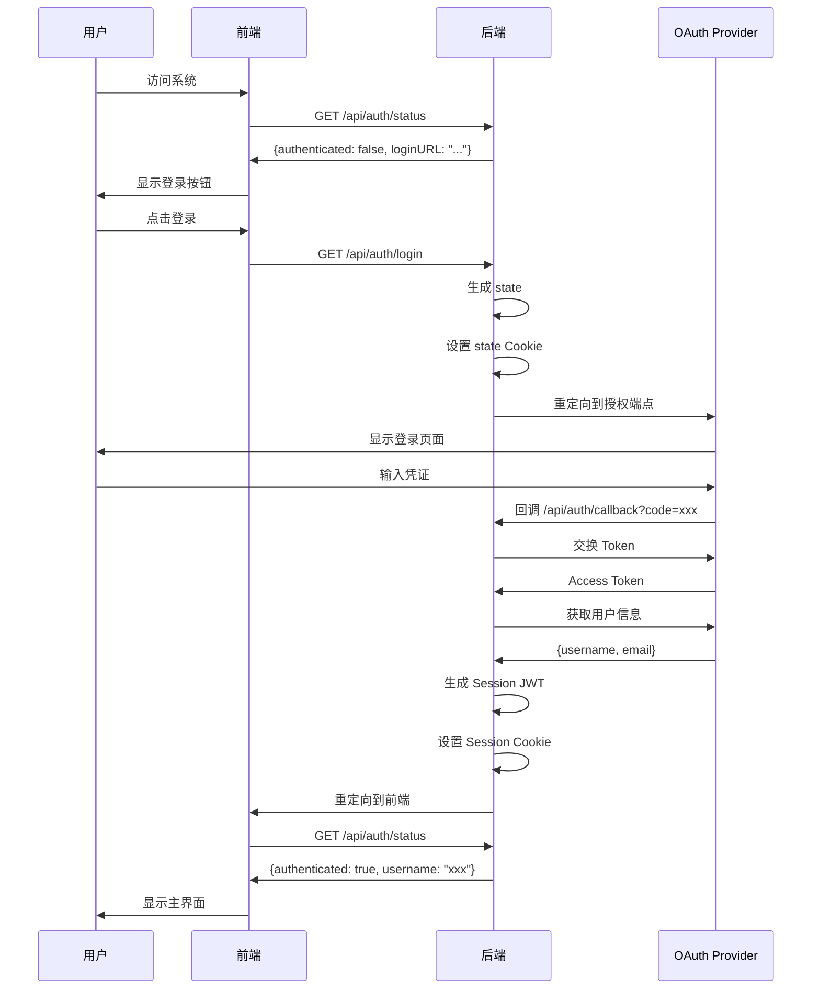
```mermaid
sequenceDiagram
    participant U as 用户
    participant F as 前端
    participant B as 后端
    participant O as OAuth Provider

    U->>F: 访问系统
    F->>B: GET /api/auth/status
    B->>F: {authenticated: false, loginURL: "..."}
    F->>U: 显示登录按钮

    U->>F: 点击登录
    F->>B: GET /api/auth/login
    B->>B: 生成 state
    B->>B: 设置 state Cookie
    B->>O: 重定向到授权端点

    O->>U: 显示登录页面
    U->>O: 输入凭证
    O->>B: 回调 /api/auth/callback?code=xxx

    B->>O: 交换 Token
    O->>B: Access Token
    B->>O: 获取用户信息
    O->>B: {username, email}

    B->>B: 生成 Session JWT
    B->>B: 设置 Session Cookie
    B->>F: 重定向到前端

    F->>B: GET /api/auth/status
    B->>F: {authenticated: true, username: "xxx"}
    F->>U: 显示主界面
```

### 5.2 创建 Pod 流程

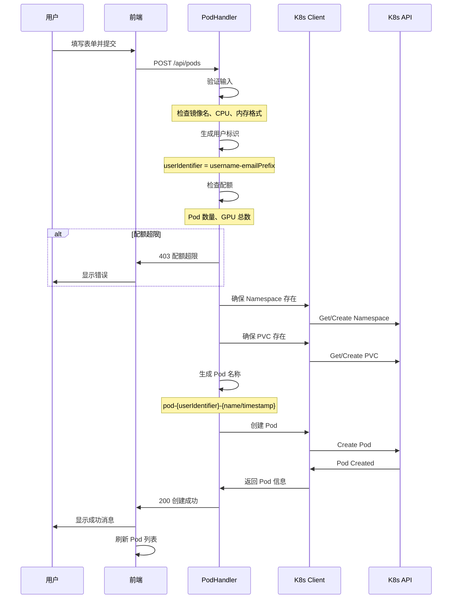
```mermaid
sequenceDiagram
    participant U as 用户
    participant F as 前端
    participant H as PodHandler
    participant K as K8s Client
    participant API as K8s API

    U->>F: 填写表单并提交
    F->>H: POST /api/pods

    H->>H: 验证输入
    Note over H: 检查镜像名、CPU、内存格式

    H->>H: 生成用户标识
    Note over H: userIdentifier = username-emailPrefix

    H->>H: 检查配额
    Note over H: Pod 数量、GPU 总数

    alt 配额超限
        H->>F: 403 配额超限
        F->>U: 显示错误
    end

    H->>K: 确保 Namespace 存在
    K->>API: Get/Create Namespace

    H->>K: 确保 PVC 存在
    K->>API: Get/Create PVC

    H->>H: 生成 Pod 名称
    Note over H: pod-{userIdentifier}-{name/timestamp}

    H->>K: 创建 Pod
    K->>API: Create Pod
    API->>K: Pod Created

    K->>H: 返回 Pod 信息
    H->>F: 200 创建成功
    F->>U: 显示成功消息
    F->>F: 刷新 Pod 列表
```

### 5.3 镜像保存流程

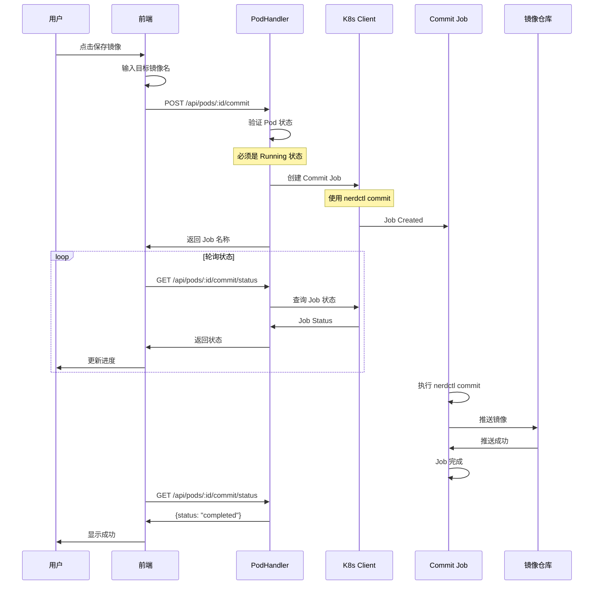
```mermaid
sequenceDiagram
    participant U as 用户
    participant F as 前端
    participant H as PodHandler
    participant K as K8s Client
    participant J as Commit Job
    participant R as 镜像仓库

    U->>F: 点击保存镜像
    F->>F: 输入目标镜像名
    F->>H: POST /api/pods/:id/commit

    H->>H: 验证 Pod 状态
    Note over H: 必须是 Running 状态

    H->>K: 创建 Commit Job
    Note over K: 使用 nerdctl commit
    K->>J: Job Created

    H->>F: 返回 Job 名称

    loop 轮询状态
        F->>H: GET /api/pods/:id/commit/status
        H->>K: 查询 Job 状态
        K->>H: Job Status
        H->>F: 返回状态
        F->>U: 更新进度
    end

    J->>J: 执行 nerdctl commit
    J->>R: 推送镜像
    R->>J: 推送成功
    J->>J: Job 完成

    F->>H: GET /api/pods/:id/commit/status
    H->>F: {status: "completed"}
    F->>U: 显示成功
```

### 5.4 自动清理流程

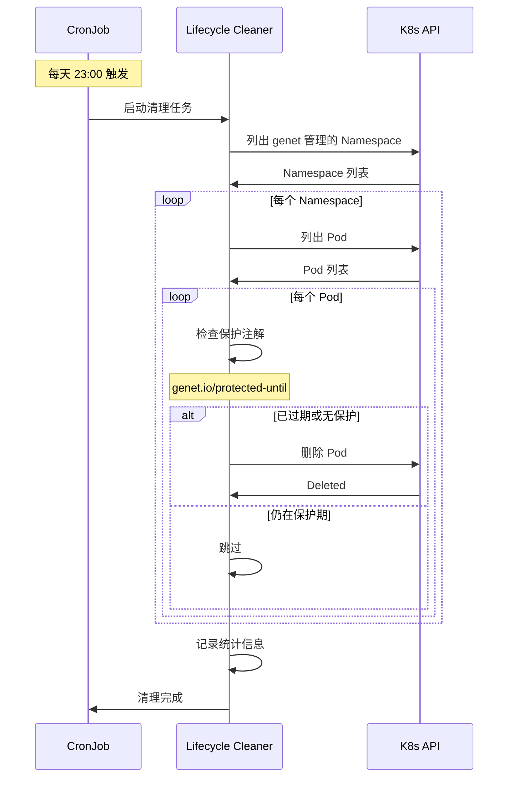
```mermaid
sequenceDiagram
    participant C as CronJob
    participant L as Lifecycle Cleaner
    participant K as K8s API

    Note over C: 每天 23:00 触发
    C->>L: 启动清理任务

    L->>K: 列出 genet 管理的 Namespace
    K->>L: Namespace 列表

    loop 每个 Namespace
        L->>K: 列出 Pod
        K->>L: Pod 列表

        loop 每个 Pod
            L->>L: 检查保护注解
            Note over L: genet.io/protected-until

            alt 已过期或无保护
                L->>K: 删除 Pod
                K->>L: Deleted
            else 仍在保护期
                L->>L: 跳过
            end
        end
    end

    L->>L: 记录统计信息
    L->>C: 清理完成
```

---

## 6. 数据模型

### 6.1 Pod 请求模型

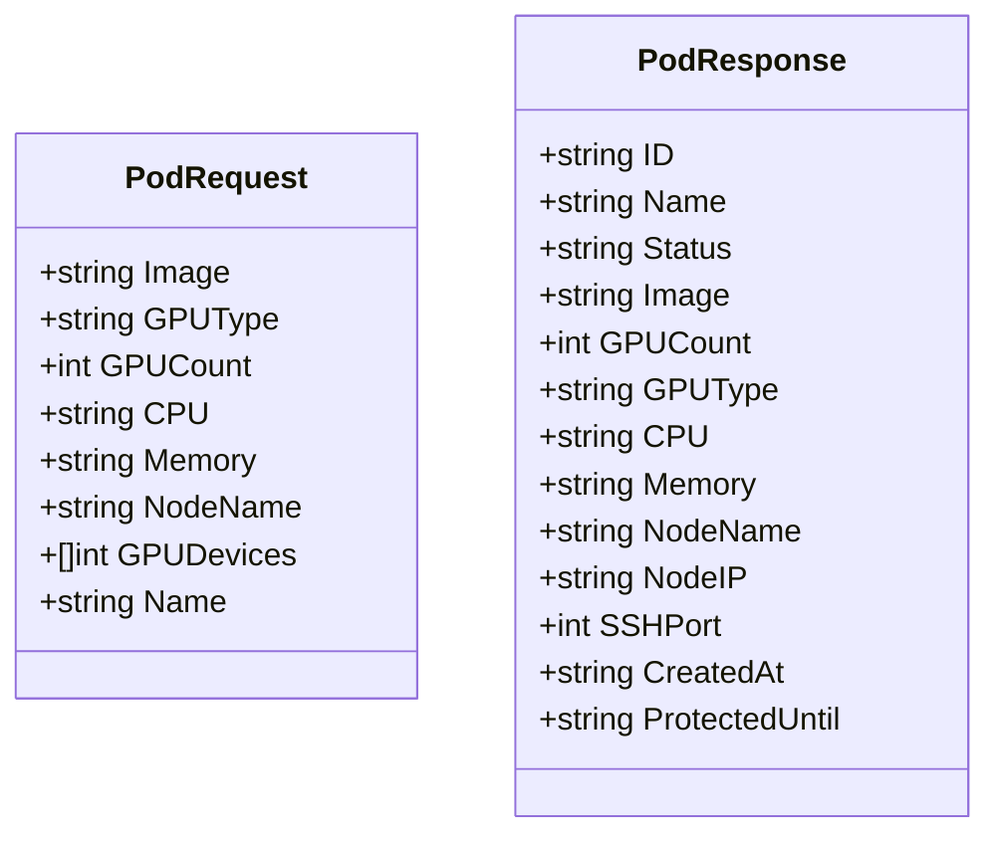
```mermaid
classDiagram
    class PodRequest {
        +string Image
        +string GPUType
        +int GPUCount
        +string CPU
        +string Memory
        +string NodeName
        +[]int GPUDevices
        +string Name
    }

    class PodResponse {
        +string ID
        +string Name
        +string Status
        +string Image
        +int GPUCount
        +string GPUType
        +string CPU
        +string Memory
        +string NodeName
        +string NodeIP
        +int SSHPort
        +string CreatedAt
        +string ProtectedUntil
    }
```

### 6.2 GPU 热力图模型

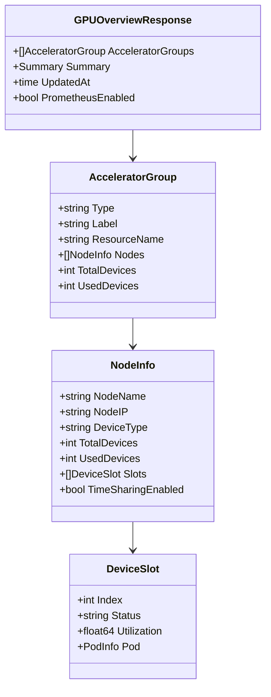
```mermaid
classDiagram
    class GPUOverviewResponse {
        +[]AcceleratorGroup AcceleratorGroups
        +Summary Summary
        +time UpdatedAt
        +bool PrometheusEnabled
    }

    class AcceleratorGroup {
        +string Type
        +string Label
        +string ResourceName
        +[]NodeInfo Nodes
        +int TotalDevices
        +int UsedDevices
    }

    class NodeInfo {
        +string NodeName
        +string NodeIP
        +string DeviceType
        +int TotalDevices
        +int UsedDevices
        +[]DeviceSlot Slots
        +bool TimeSharingEnabled
    }

    class DeviceSlot {
        +int Index
        +string Status
        +float64 Utilization
        +PodInfo Pod
    }

    GPUOverviewResponse --> AcceleratorGroup
    AcceleratorGroup --> NodeInfo
    NodeInfo --> DeviceSlot
```

### 6.3 配置模型

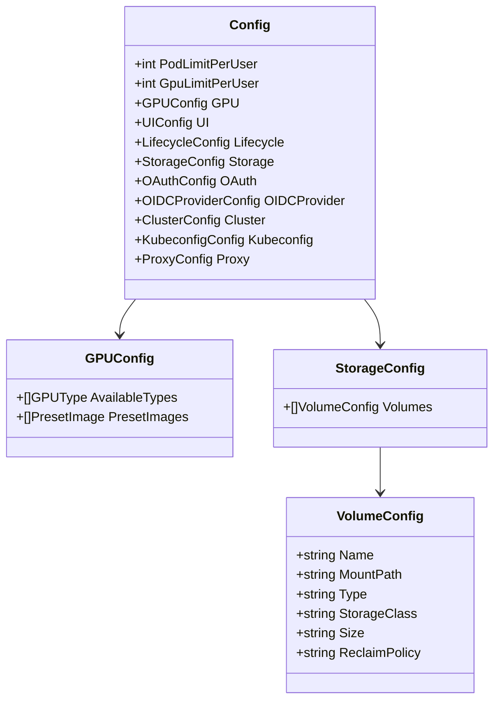
```mermaid
classDiagram
    class Config {
        +int PodLimitPerUser
        +int GpuLimitPerUser
        +GPUConfig GPU
        +UIConfig UI
        +LifecycleConfig Lifecycle
        +StorageConfig Storage
        +OAuthConfig OAuth
        +OIDCProviderConfig OIDCProvider
        +ClusterConfig Cluster
        +KubeconfigConfig Kubeconfig
        +ProxyConfig Proxy
    }

    class GPUConfig {
        +[]GPUType AvailableTypes
        +[]PresetImage PresetImages
    }

    class StorageConfig {
        +[]VolumeConfig Volumes
    }

    class VolumeConfig {
        +string Name
        +string MountPath
        +string Type
        +string StorageClass
        +string Size
        +string ReclaimPolicy
    }

    Config --> GPUConfig
    Config --> StorageConfig
    StorageConfig --> VolumeConfig
```

---

## 7. 配置系统

### 7.1 配置层级

```mermaid
graph TB
    subgraph 配置来源
        File[配置文件 YAML]
        Env[环境变量]
        Default[默认值]
    end

    subgraph 优先级
        P1[1. 环境变量]
        P2[2. 配置文件]
        P3[3. 默认值]
    end

    File --> P2
    Env --> P1
    Default --> P3

    P1 --> Final[最终配置]
    P2 --> Final
    P3 --> Final
```

### 7.2 核心配置项

| 配置项 | 类型 | 说明 |
|--------|------|------|
| `podLimitPerUser` | int | 每用户 Pod 数量限制 |
| `gpuLimitPerUser` | int | 每用户 GPU 总数限制 |
| `gpu.availableTypes` | array | 可用 GPU 类型列表 |
| `gpu.presetImages` | array | 预设镜像列表 |
| `storage.volumes` | array | 存储卷配置 |
| `oauth.enabled` | bool | 是否启用 OAuth |
| `oauth.providerURL` | string | OIDC Provider URL |
| `lifecycle.autoDeleteTime` | string | 自动删除时间 |
| `kubeconfig.mode` | string | cert 或 oidc |
| `prometheusURL` | string | Prometheus 地址 |

### 7.3 存储配置示例

```yaml
storage:
  volumes:
    # 用户独立工作空间
    - name: "workspace"
      mountPath: "/workspace"
      type: "pvc"
      storageClass: "standard"
      size: "50Gi"
      accessMode: "ReadWriteOnce"
      reclaimPolicy: "Retain"  # Pod 删除时保留

    # 共享数据目录
    - name: "shared-data"
      mountPath: "/data"
      type: "hostpath"
      hostPath: "/mnt/shared-data"
      readOnly: true
```

---

## 8. 部署架构

### 8.1 Kubernetes 部署

```mermaid
graph TB
    subgraph genet-system Namespace
        subgraph Deployments
            Backend[genet-backend x2]
            Frontend[genet-frontend x2]
        end

        subgraph Services
            BackendSvc[backend-svc:8080]
            FrontendSvc[frontend-svc:80]
        end

        subgraph ConfigMaps
            ConfigCM[genet-config]
        end

        subgraph CronJobs
            CleanupJob[cleanup-cronjob]
        end

        subgraph RBAC
            SA[ServiceAccount]
            CR[ClusterRole]
            CRB[ClusterRoleBinding]
        end
    end

    subgraph Ingress
        Ing[Ingress Controller]
    end

    Ing --> FrontendSvc
    Ing --> BackendSvc
    Backend --> ConfigCM
    Backend --> SA
    CleanupJob --> SA
```

### 8.2 Helm Chart 结构

```
helm/genet/
├── Chart.yaml              # Chart 元数据
├── values.yaml             # 默认配置
└── templates/
    ├── deployment-backend.yaml
    ├── deployment-frontend.yaml
    ├── service-backend.yaml
    ├── service-frontend.yaml
    ├── configmap-config.yaml
    ├── cronjob-cleanup.yaml
    ├── serviceaccount.yaml
    ├── clusterrole.yaml
    ├── clusterrolebinding.yaml
    └── ingress.yaml
```

### 8.3 部署命令

```bash
# 安装
helm install genet ./helm/genet \
  --namespace genet-system \
  --create-namespace \
  --set backend.config.oauth.enabled=true \
  --set backend.config.oauth.providerURL="https://auth.example.com"

# 升级
helm upgrade genet ./helm/genet \
  --namespace genet-system \
  --reuse-values \
  --set backend.replicas=3

# 卸载
helm uninstall genet --namespace genet-system
```

---

## API 端点汇总

| 方法 | 端点 | 说明 | 认证 |
|------|------|------|------|
| GET | `/api/auth/status` | 认证状态 | 可选 |
| GET | `/api/auth/login` | OAuth 登录 | 否 |
| GET | `/api/auth/callback` | OAuth 回调 | 否 |
| GET | `/api/config` | 系统配置 | 否 |
| GET | `/api/pods` | Pod 列表 | 是 |
| POST | `/api/pods` | 创建 Pod | 是 |
| GET | `/api/pods/:id` | Pod 详情 | 是 |
| DELETE | `/api/pods/:id` | 删除 Pod | 是 |
| POST | `/api/pods/:id/extend` | 延长保护 | 是 |
| GET | `/api/pods/:id/logs` | Pod 日志 | 是 |
| GET | `/api/pods/:id/events` | Pod 事件 | 是 |
| GET | `/api/pods/:id/describe` | Pod 描述 | 是 |
| POST | `/api/pods/:id/commit` | 保存镜像 | 是 |
| GET | `/api/pods/:id/commit/status` | Commit 状态 | 是 |
| GET | `/api/pods/:id/shared-gpus` | 共用 GPU | 是 |
| GET | `/api/cluster/gpu-overview` | GPU 热力图 | 否 |
| GET | `/api/kubeconfig` | Kubeconfig | 是 |
| GET | `/api/kubeconfig/download` | 下载 Kubeconfig | 是 |

---

## 总结

Genet 是一个功能完整的 GPU Pod 管理平台，具有以下特点：

1. **无数据库设计** - 状态存储在 K8s 注解中
2. **灵活的认证** - 支持 OAuth/OIDC/代理头部
3. **完善的资源管理** - 配额控制、自动清理
4. **可视化监控** - GPU 热力图、实时日志
5. **生产级部署** - Helm Chart、高可用支持
