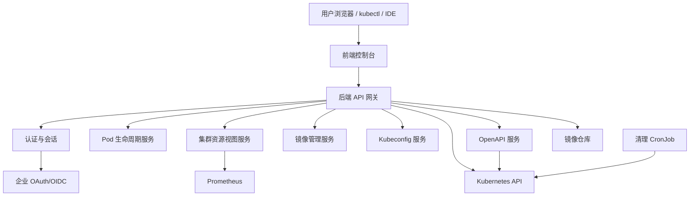
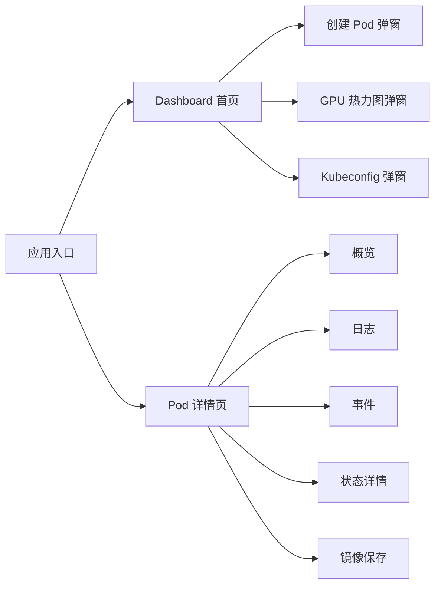
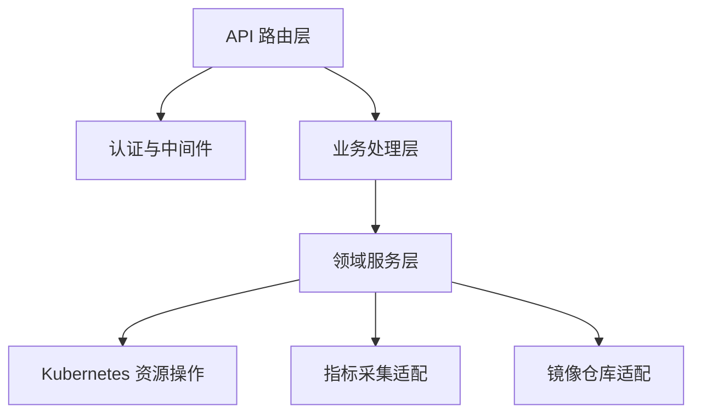
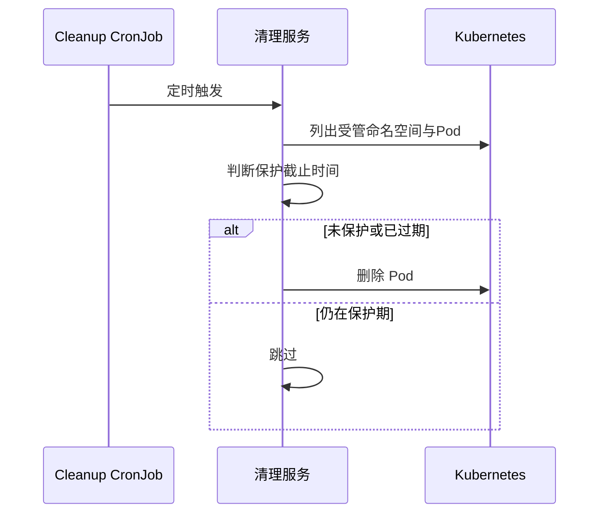
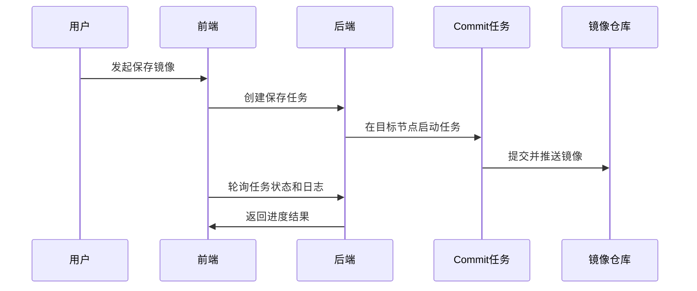
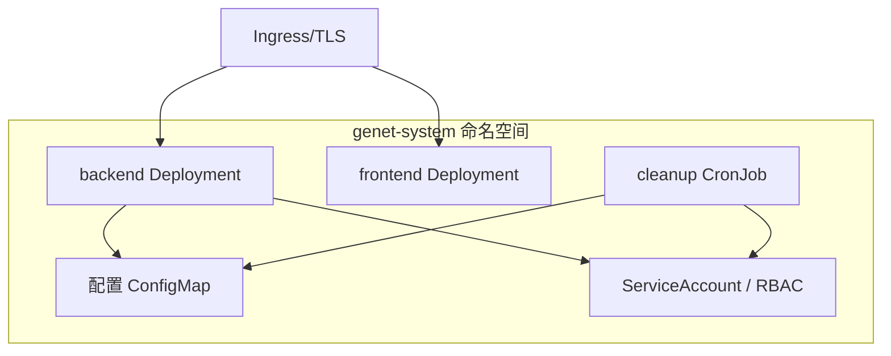

# Genet 项目架构与功能总览

## 1. 项目定位

Genet 是一个面向 AI/ML 团队的 Kubernetes GPU Pod 自助申请与管理平台，目标是让用户通过 Web 界面完成环境创建、资源选择、连接使用、生命周期管理与镜像沉淀，降低 GPU 集群使用门槛并提升资源利用率。

核心价值：
- 统一入口：用户无需掌握复杂的 Kubernetes 命令即可申请和管理个人运行环境。
- 资源可控：通过 Pod/GPU 配额、自动清理与共享调度减少资源争抢和长期占用。
- 环境可复用：支持将运行中的环境保存为镜像，形成团队可复用资产。
- 运维可落地：支持 Helm 部署、Ingress、TLS、RBAC、Prometheus 等生产要素。

---

## 2. 系统总体架构

架构特征：
- 前后端分离：前端负责交互体验与可视化，后端负责资源编排与策略校验。
- 以 Kubernetes 为事实源：平台状态主要通过 Pod/Namespace/PVC/Job 等资源及其标签/注解表达。
- 可插拔外部能力：认证、Prometheus 指标、镜像仓库、OIDC Provider 可按需启用。

---

## 3. 核心设计原则

### 3.1 无独立数据库的状态设计

平台不依赖独立业务数据库，用户运行态通过 Kubernetes 资源及注解保存，例如创建时间、保护截止时间、GPU 设备选择、镜像来源等。这使系统部署简单、运维链路短，并天然与集群状态一致。

### 3.2 “会话即 Pod”的资源模型

每个用户可创建多个个人 Pod；Pod 是开发会话载体，生命周期明确，支持按策略自动清理与手动延长保护。

### 3.3 策略驱动的配置体系

资源规格、GPU 类型、存储卷、认证模式、清理计划、Kubeconfig 模式等均由统一配置驱动，便于不同集群环境快速适配。

---

## 4. 功能域总览

| 功能域 | 主要能力 | 业务价值 |
|---|---|---|
| Pod 生命周期 | 创建、查询、删除、详情、日志、事件、描述、延长保护 | 覆盖日常环境申请与维护全流程 |
| GPU 资源管理 | GPU 类型选择、共享/独占调度、设备级选择、热力图可视化 | 提升 GPU 使用透明度与利用率 |
| 镜像能力 | Pod 保存镜像、任务状态追踪、个人镜像记录、仓库检索与 Tag 查询 | 促进环境标准化与复用 |
| 连接与访问 | SSH/IDE 使用指引、Kubeconfig 生成与下载 | 降低研发接入成本 |
| 认证与授权 | OAuth/OIDC 会话、代理头兼容、开发模式、用户 RBAC | 兼顾企业接入与安全治理 |
| 自动治理 | 定时清理未保护 Pod | 控制资源占用与成本 |
| 开放接口 | API Key 保护的 OpenAPI（Pod/Job 管理） | 支持平台集成与自动化编排 |

---

## 5. 前端模块设计

### 5.1 页面结构

### 5.2 交互能力设计

- Dashboard
  - 展示 Pod/GPU 配额、运行实例数与清理时间提示。
  - 轮询刷新资源状态，确保页面信息接近实时。
  - 提供创建 Pod、GPU 热力图、Kubeconfig、镜像摆渡入口。
- Create Pod
  - 基础规格（镜像、CPU、内存、GPU）+ 高级调度（节点、卡位）。
  - 支持共享模式下设备级选择与可用性提示。
  - 支持用户自定义挂载（受后端白名单策略约束）。
- Pod Detail
  - 将运行信息、日志、事件、状态描述、镜像保存与连接信息集中展示。
  - 支持镜像保存进度可视化与日志查看。

### 5.3 可视化与体验

- GPU 热力图以节点/设备维度展示利用率、显存、占用者信息。
- 主题系统支持亮/暗模式切换。
- 关键操作提供状态反馈（提交中、轮询中、成功/失败提示）。

---

## 6. 后端模块设计

### 6.1 服务分层

### 6.2 主要业务模块

- Pod 管理模块
  - 处理创建校验、配额限制、节点/设备选择、删除与保护延长。
  - 负责日志、事件、描述、共享 GPU 关联查询等运维视图能力。
- 集群资源模块
  - 聚合节点资源、运行 Pod 与 Prometheus 指标，输出设备级热力图数据。
  - 支持独占和共享两种资源解释模型。
- 镜像模块
  - 通过后台任务方式执行环境保存与推送，支持状态与日志追踪。
  - 管理用户镜像记录，形成“个人镜像资产池”。
- Kubeconfig 模块
  - 支持证书模式与 OIDC 模式两类凭据下发。
  - 可在下载前确保用户命名空间权限准备完毕（按配置启用）。
- OpenAPI 模块
  - 提供受 API Key 保护的 Pod/Job 资源操作接口，定位自动化集成。

### 6.3 认证与安全模块

- 会话认证：OAuth/OIDC 登录后发放会话 Cookie。
- 兼容接入：支持从反向代理头读取用户身份。
- 开发模式：在关闭 OAuth 时可快速进入开发体验。
- OIDC Provider：可将企业 OAuth 映射为标准 OIDC，对接 Kubernetes API Server。

---

## 7. 资源调度与治理设计

### 7.1 调度模式

- 独占模式：按资源请求进行原生调度，适合高性能任务。
- 共享模式：按设备可见性与共享上限控制实现多 Pod 共享，提高卡利用率。

### 7.2 存储策略

- 支持多卷配置（PVC/HostPath）。
- 支持用户级与 Pod 级作用域：
  - 用户级：多 Pod 共享持久化工作空间。
  - Pod 级：与 Pod 生命周期绑定，适合临时数据。
- 可选用户自定义挂载，配合路径白名单降低风险。

### 7.3 生命周期治理

---

## 8. 镜像沉淀流程设计

流程特征：
- 异步任务化，避免长耗时操作阻塞交互请求。
- 任务结果可追踪，便于定位失败原因。
- 成功后自动沉淀到用户镜像记录，支持下次创建直接复用。

---

## 9. 认证与访问设计

### 9.1 Web 访问

- 支持 OAuth/OIDC 登录跳转与会话保持。
- 未启用 OAuth 时可进入开发模式，便于本地联调。

### 9.2 集群访问

- Kubeconfig 证书模式：适合内网与快速接入。
- Kubeconfig OIDC 模式：适合统一身份治理与审计链路。

### 9.3 权限模型

- 平台服务账户具备受控的集群管理权限（命名空间、Pod、PVC、Job、证书与 RBAC 相关能力）。
- 用户侧可按需自动创建命名空间内角色绑定，实现“自有空间自主管理”。

---

## 10. 部署与运维架构

### 10.1 Helm 部署拓扑

### 10.2 运维特性

- 支持前后端副本扩展，满足高可用需求。
- 支持 Ingress 与 TLS，可配合 cert-manager 自动签发证书。
- 前端通过 Nginx 统一静态托管与 API 反向代理。
- 清理任务独立为 CronJob，避免与在线请求耦合。

---

## 11. 配置体系与可扩展性

配置可覆盖的关键方向：
- 资源策略：Pod/GPU 配额、GPU 类型、共享上限。
- 调度策略：节点选择、亲和性、Runtime Class、资源模式。
- 存储策略：卷类型、作用域、容量、读写权限、用户自定义挂载策略。
- 访问策略：OAuth/OIDC、OIDC Provider、Kubeconfig 模式、用户 RBAC。
- 可观测性：Prometheus 地址与指标标签映射。
- 镜像策略：仓库地址/认证、仓库类型、系统依赖镜像。

扩展路径：
- 接入更多加速卡类型与指标体系。
- 通过 OpenAPI 与外部平台（工单、调度、CI）联动。
- 在不改动主流程的前提下扩展认证与存储后端形态。

---

## 12. 典型用户流程（业务视角）

1. 用户登录平台后查看资源概览与热力图。
2. 创建 Pod 时选择镜像、规格、节点与设备。
3. 通过 SSH / IDE / kubectl 进入环境开展开发训练。
4. 任务完成后将环境保存为镜像，供后续复用。
5. Pod 到期自动清理；若仍需保留可在清理前延长保护。

---

## 13. 项目总结

Genet 的核心优势在于“平台能力与 Kubernetes 原生资源的高一致性”：
- 管理面简洁：无独立业务数据库，部署与维护成本低。
- 资源面可控：从配额、调度到清理形成闭环治理。
- 体验面完整：从创建、连接、观测到沉淀覆盖用户全链路。
- 组织面友好：支持企业认证体系与开放接口，便于纳入现有平台生态。

面向团队协作场景，Genet 已具备从“个人开发环境申请工具”走向“GPU 资源运营平台”的架构基础。
